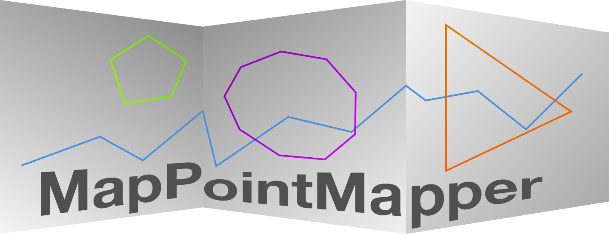

MapPointMapper
==============

`MapPointMapper` is an OS X application designed to plot latitude and longitude coordinates for ease of visualization of geospacial data.

## Requirements

`MapPointMapper` requires at least OS X 10.10 and Xcode 6.1

The `swift1.2` branch requires OS X 10.10 and at least Xcode 6.3 Beta 1

## Usage / Plotting Points

## Known Issues

- Parsing only supports [Well-known text][well-known-text] format.

## Change Log

- 2015.02.17 - Added logo and gif - [dmiedema][dmiedema]
- 2015.02.13 - Randomize the colorwell after adding a line to the map - [theoretick][theoretick]
- 2015.02.13 - Center map to contain all polygons drawn & add button to center map around all lines on the map. - [theoretick][theoretick] & [dmiedema][dmiedema]
- 2015.02.11 - Add Center US Button - [theoretick][theoretick]
- 2015.02.09 - Support [Well-known text][well-known-text] formats - [dmiedema][dmiedema]

[well-known-text]: https://en.wikipedia.org/wiki/Well-known_text
[dmiedema]: https://github.com/dmiedema
[theoretick]: https://github.com/theoretick

## License

    The MIT License (MIT)

    Copyright (c) 2014 Househappy

    Permission is hereby granted, free of charge, to any person obtaining a copy
    of this software and associated documentation files (the "Software"), to deal
    in the Software without restriction, including without limitation the rights
    to use, copy, modify, merge, publish, distribute, sublicense, and/or sell
    copies of the Software, and to permit persons to whom the Software is
    furnished to do so, subject to the following conditions:

    The above copyright notice and this permission notice shall be included in all
    copies or substantial portions of the Software.

    THE SOFTWARE IS PROVIDED "AS IS", WITHOUT WARRANTY OF ANY KIND, EXPRESS OR
    IMPLIED, INCLUDING BUT NOT LIMITED TO THE WARRANTIES OF MERCHANTABILITY,
    FITNESS FOR A PARTICULAR PURPOSE AND NONINFRINGEMENT. IN NO EVENT SHALL THE
    AUTHORS OR COPYRIGHT HOLDERS BE LIABLE FOR ANY CLAIM, DAMAGES OR OTHER
    LIABILITY, WHETHER IN AN ACTION OF CONTRACT, TORT OR OTHERWISE, ARISING FROM,
    OUT OF OR IN CONNECTION WITH THE SOFTWARE OR THE USE OR OTHER DEALINGS IN THE
    SOFTWARE.

